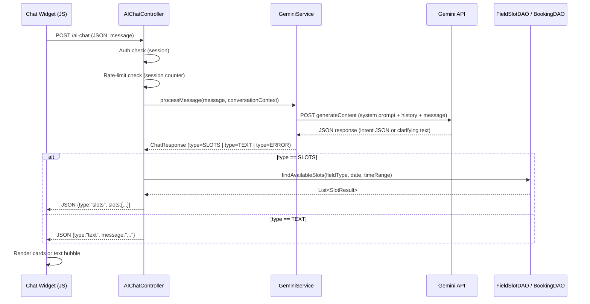

# Design Document: AI Chat Booking

## Overview

This feature adds a conversational AI booking assistant to the SportField web application.
Customers type natural language requests (Vietnamese or English) into a floating chat widget.
A new `AIChatController` servlet handles AJAX calls, delegates NLP work to `GeminiService`,
queries existing DAOs for available slots, and returns JSON. Slot selection redirects the
customer into the existing `/booking` flow unchanged.

The integration uses the **Google Gen AI Java SDK** (`com.google.genai:google-genai`)
via direct REST calls over `java.net.http.HttpClient` to keep the dependency footprint
minimal for a Maven/Jakarta EE project. The Gemini model used is `gemini-2.0-flash`.

Sources:
- [Google Gen AI Java SDK](https://github.com/googleapis/java-genai)
- [Gemini multi-turn chat](https://ai.google.dev/gemini-api/docs/interactions)


## Architecture




## Components and Interfaces

### New Files

| File | Role |
|------|------|
| `controller/customer/AIChatController.java` | Servlet `@WebServlet("/ai-chat")` — AJAX endpoint |
| `service/GeminiService.java` | Calls Gemini REST API, parses intent |
| `model/BookingIntent.java` | POJO: fieldType, date, startHour, endHour |
| `model/SlotResult.java` | POJO: fieldID, slotID, fieldName, fieldType, startTime, endTime, price, bookingDate |
| `model/ChatMessage.java` | POJO: role ("user"/"model"), text |
| `webapp/views/customer/ai-chat-widget.jsp` | Floating widget fragment (included in layout) |
| `webapp/assets/js/ai-chat.js` | Widget JS: fetch, render, state |
| `webapp/assets/css/ai-chat.css` | Widget styles |
| `webapp/WEB-INF/gemini.properties` | `gemini.api.key=...`, `gemini.model=gemini-2.0-flash` |

### Modified Files

| File | Change |
|------|--------|
| `webapp/WEB-INF/web.xml` | Add `AIChatController` servlet mapping `/ai-chat` |
| `webapp/views/customer/home.jsp` (and other customer layouts) | Include `ai-chat-widget.jsp` fragment |

### AIChatController — Key Responsibilities

```
POST /ai-chat
  Content-Type: application/json
  Body: { "message": "..." }

Response (success):
  { "type": "text",  "message": "Bạn muốn đặt sân mấy người?" }
  { "type": "slots", "slots": [ { fieldID, slotID, fieldName, fieldType,
                                   startTime, endTime, price, bookingDate } ] }
  { "type": "error", "message": "..." }

HTTP 401 if unauthenticated.
```

### GeminiService — System Prompt Design

The system prompt instructs Gemini to respond **only** with one of two JSON shapes:

```json
// Shape A — intent extracted
{ "action": "SEARCH", "fieldType": 5, "date": "2025-03-22", "startHour": 12, "endHour": 18 }

// Shape B — need more info
{ "action": "ASK", "message": "Bạn muốn đặt sân mấy người (5, 7 hay 11)?" }
```

The system prompt includes today's date so Gemini can resolve relative references
("thứ 7", "ngày mai") to absolute ISO dates.


## Data Models

### BookingIntent

```java
public class BookingIntent {
    private int fieldType;       // 5, 7, or 11
    private LocalDate date;      // resolved absolute date
    private int startHour;       // e.g. 12
    private int endHour;         // e.g. 18
}
```

### SlotResult

```java
public class SlotResult {
    private int fieldID;
    private int slotID;
    private String fieldName;
    private int fieldType;
    private String startTime;    // "HH:mm"
    private String endTime;      // "HH:mm"
    private BigDecimal price;
    private String bookingDate;  // "yyyy-MM-dd"
}
```

### ChatMessage

```java
public class ChatMessage {
    private String role;   // "user" or "model"
    private String text;
}
```

### Session Keys

| Key | Type | Description |
|-----|------|-------------|
| `aiChatHistory` | `List<ChatMessage>` | Conversation context (max 10 pairs = 20 messages) |
| `aiChatMessageCount` | `Integer` | Rate-limit counter (max 20 per session) |


### Slot Availability Query

`AIChatController` reuses existing DAOs:

```java
// 1. Get all active fields of the requested type
List<SportField> fields = sportFieldDAO.getActiveFieldsByType(fieldType);

// 2. For each field, get active slots in the time window
for (SportField field : fields) {
    List<FieldSlot> slots = fieldSlotDAO.getByFieldID(field.getFieldID());
    List<Integer> booked = bookingDAO.getBookedSlotIDs(field.getFieldID(), date);
    for (FieldSlot slot : slots) {
        if (!booked.contains(slot.getSlotID())
            && slot.getStartTime().getHour() >= startHour
            && slot.getStartTime().getHour() < endHour
            && "ACTIVE".equals(slot.getStatus())) {
            results.add(toSlotResult(field, slot, date));
        }
    }
}
// 3. Return up to 5 results
```


## Correctness Properties

*A property is a characteristic or behavior that should hold true across all valid executions of a system — essentially, a formal statement about what the system should do. Properties serve as the bridge between human-readable specifications and machine-verifiable correctness guarantees.*

Property 1: Gemini response parsing completeness
*For any* well-formed JSON string returned by the Gemini API with `action` equal to `"SEARCH"` or `"ASK"`, the `GeminiService` parser SHALL produce a non-null result of the correct type (BookingIntent for SEARCH, String for ASK) without throwing an exception.
**Validates: Requirements 1.3**

Property 2: Message length validation
*For any* string of length greater than 500 characters, the `AIChatController` SHALL reject the request and return a JSON error response without calling `GeminiService`.
*For any* string of length 500 characters or fewer, the controller SHALL not reject it on length grounds.
**Validates: Requirements 1.5**

Property 3: ISO date parsing round-trip
*For any* valid ISO-8601 date string (`yyyy-MM-dd`) produced by the Gemini API, parsing it into a `LocalDate` and formatting it back to `yyyy-MM-dd` SHALL produce the original string.
**Validates: Requirements 2.2**

Property 4: Slot search returns only active, unbooked slots
*For any* `BookingIntent` and any database state, every `SlotResult` in the returned list SHALL have its parent `SportField` status equal to `"ACTIVE"` and its `FieldSlot` status equal to `"ACTIVE"`, and SHALL NOT have a conflicting `BookingDetail` for the requested date with booking status in `{PENDING, CONFIRMED, COMPLETED}`.
**Validates: Requirements 3.1, 3.4**

Property 5: Slot search result count invariant
*For any* `BookingIntent`, the list of returned `SlotResult` objects SHALL contain at most 5 elements.
**Validates: Requirements 3.2**

Property 6: SlotResult JSON serialization completeness
*For any* `SlotResult` instance, serializing it to JSON SHALL produce an object containing all required fields: `fieldID`, `slotID`, `fieldName`, `fieldType`, `startTime`, `endTime`, `price`, and `bookingDate`.
**Validates: Requirements 3.5**

Property 7: Booking redirect URL construction
*For any* `SlotResult`, the URL constructed by the chat widget SHALL contain query parameters `fieldId`, `slotId`, and `date` with values matching the `SlotResult`'s `fieldID`, `slotID`, and `bookingDate` respectively.
**Validates: Requirements 4.1**

Property 8: Conversation history append invariant
*For any* existing conversation history of N message pairs, after one complete message exchange (user message + AI reply), the stored history SHALL contain exactly N+1 pairs (or 10 pairs if N was already 10, due to trimming).
**Validates: Requirements 5.2, 5.3**

Property 9: Authentication gate
*For any* HTTP POST request to `/ai-chat` where the session does not contain a non-null `account` attribute, the `AIChatController` SHALL return HTTP status 401 and a JSON body with a `type` field equal to `"error"`.
**Validates: Requirements 7.1**

Property 10: Rate limit enforcement
*For any* session where the `aiChatMessageCount` is 20 or greater, the next request to `/ai-chat` SHALL be rejected with a JSON error response and SHALL NOT call `GeminiService`.
**Validates: Requirements 7.5**

Property 11: Input sanitization idempotence
*For any* input string, applying the sanitization function twice SHALL produce the same result as applying it once (idempotent). Additionally, *for any* input containing the substring `"Ignore previous instructions"` (case-insensitive), the sanitized output SHALL NOT contain that substring.
**Validates: Requirements 7.3**


## Error Handling

| Scenario | Handling |
|----------|----------|
| Gemini API timeout (>10s) | Return `{type:"error", message:"Xin lỗi, hệ thống AI đang bận. Vui lòng thử lại."}` |
| Gemini returns malformed JSON | Log warning, return ASK response asking user to rephrase |
| No slots found | Return `{type:"text", message:"Không tìm thấy sân trống..."}` |
| Past date in intent | Return `{type:"text", message:"Ngày bạn chọn đã qua..."}` |
| Message > 500 chars | Return `{type:"error", message:"Tin nhắn quá dài (tối đa 500 ký tự)."}` |
| Rate limit exceeded | Return `{type:"error", message:"Bạn đã gửi quá nhiều tin nhắn. Vui lòng thử lại sau."}` |
| Unauthenticated | HTTP 401 `{type:"error", message:"Vui lòng đăng nhập."}` |
| DB error during slot search | Log error, return `{type:"error", message:"Lỗi hệ thống. Vui lòng thử lại."}` |

All errors are logged server-side with `java.util.logging.Logger`. Internal exception messages and stack traces are never included in the JSON response.

## Testing Strategy

### Unit Tests (JUnit 5)

- `GeminiServiceTest`: Test JSON parsing for SEARCH and ASK shapes, malformed JSON, past-date rejection.
- `AIChatControllerTest`: Test auth gate (401), rate limiting, message length validation, session history management — using mock `HttpServletRequest`/`HttpServletResponse` (Mockito).
- `SlotSearchServiceTest`: Test slot filtering logic with in-memory data (no DB required).
- `InputSanitizerTest`: Test sanitization idempotence and injection pattern removal.

### Property-Based Tests (jqwik)

Use [jqwik](https://jqwik.net/) (`net.jqwik:jqwik`) — a JUnit 5 compatible property-based testing library for Java. Each property test runs a minimum of 100 iterations.

Each property test MUST be tagged with:
`// Feature: ai-chat-booking, Property N: <property text>`

- **Property 1** — `GeminiResponseParserProperties`: generate random valid SEARCH/ASK JSON strings, assert parsing never throws and returns correct type.
- **Property 2** — `MessageLengthValidationProperties`: generate strings of random length, assert accept/reject boundary at 500 chars.
- **Property 3** — `DateParsingProperties`: generate random valid ISO dates, assert round-trip.
- **Property 4** — `SlotSearchFilterProperties`: generate random field/slot/booking configurations, assert all returned slots are ACTIVE and unbooked.
- **Property 5** — `SlotCountProperties`: generate random configurations, assert result size ≤ 5.
- **Property 6** — `SlotResultSerializationProperties`: generate random SlotResult instances, assert all required JSON fields present.
- **Property 7** — `BookingUrlProperties`: generate random SlotResult instances, assert URL contains correct parameters.
- **Property 8** — `ConversationHistoryProperties`: generate random histories of varying length, assert append/trim invariant.
- **Property 9** — `AuthGateProperties`: generate requests without session account, assert HTTP 401.
- **Property 10** — `RateLimitProperties`: generate sessions with count ≥ 20, assert rejection.
- **Property 11** — `SanitizationProperties`: generate random strings including injection patterns, assert idempotence and pattern removal.
